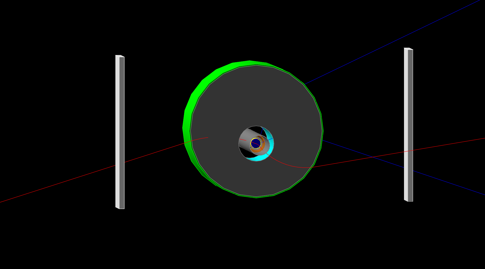

# CTscintillators
Geant4 simulation of CT scintillators

All the pions are generated from the degrader with the usual multiplicity and spectrum.

I generated 10^5 annihilation and obtained the following geometric efficiency for the "OR"

0.193 +/- 0.001

This means that if you get 10000 counts in your dump, you have annihilated ~51800 pbars.

So we trap something like 250k antiprotons per shot in Nov 26 2016.

## Installation Instructions

### Basic Requirments

* [ROOT][rootlink]

  [rootlink]: https://root.cern.ch/ "ROOT website"
  
* [Geant4][g4link]

  [g4link]: http://geant4.web.cern.ch/ "Geant4 website"

If you have these pre-requisites, then you also have [CMake][cmakelink] **version >=3.0**

[cmakelink]: https://cmake.org/ "CMake website"

### Installation Steps

`$ mkdir build`

`$ cd build/`

In CentOS7 the required version of [CMake][cmakelink] is called by invoking `cmake3`, while in other OS, e.g. Ubuntu, just issuing `cmake` is enough

`$ cmake3 .. -DCMAKE_INSTALL_PREFIX=..`

`$ cmake3 --build . --target install -- -jN`

where `N` is number of concurrent processes.

The executable and the macros are copied into the `bin` folder.

